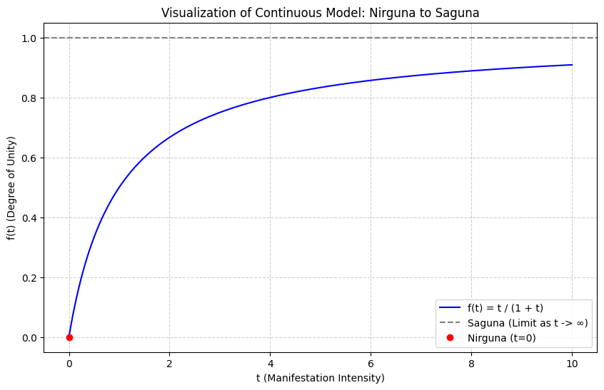
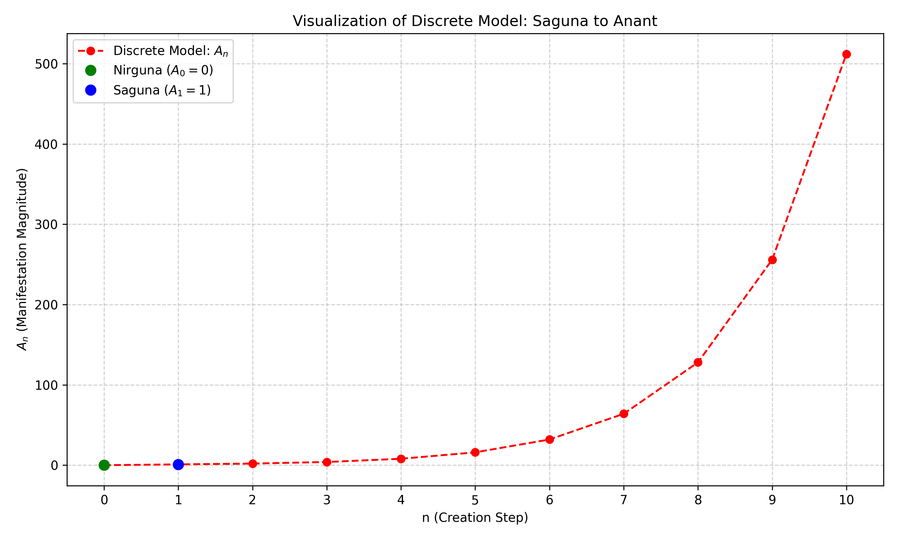
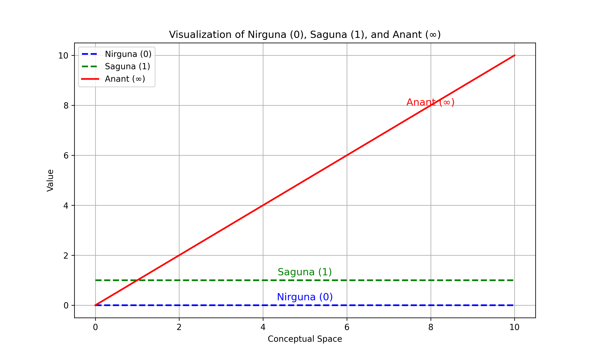
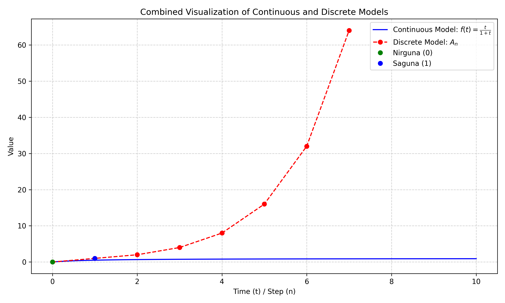

# Mathematical Modeling of Hindu Philosophy

This repository contains the **Python codes, LaTeX files, and images** developed for the research paper titled **"Mathematical Modeling of Hindu Philosophy: Zero, One, and Infinity"**.

It explores the mathematical representation of fundamental concepts in Hindu philosophy, such as **Nirguna (Zero)**, **Saguna (One)**, and **Anant (Infinity)**, through continuous, discrete, and limit-based models.

---

## 📂 Repository Structure

| Folder/File         | Description                                                        |
|--------------------|--------------------------------------------------------------------|
| `python_codes/`     | Python scripts to generate visualizations of the mathematical models. |
| `latex_paper/`      | LaTeX files for the paper including comparison tables and the main manuscript. |
| `images/`           | Generated graphs and conceptual diagrams.                          |
| `README.md`         | This file describing the project, structure, and usage.            |

---

## 🧮 Python Codes

> All scripts are inside the [`python_codes/`](python_codes/) folder.

* **Continuous Model:** `formula1_continuous_model.py`
    * Formula: $f(t) = t / (1 + t)$
    * Visualization:
    

* **Discrete Model:** `formula2_discrete_model.py`
    * Formula: $A_n = 2^{n-1}$
    * Visualization:
    

* **Limit-Based Model:** `formula3_limit_based_model.py`
    * Conceptual representation of the unification of 0, 1, and $\infty$.
    * Visualization:
    

* **Combined Model:** `combined_model_visualization.py`
    * Combines the continuous and discrete models on a single graph.
    * Visualization:
    

---

## 📄 LaTeX Paper

> Files are inside the [`latex_paper/`](latex_paper/) folder.

* `comparison_table.tex`: Detailed comparison of the mathematical models.
* `main.tex` (optional): The complete manuscript in LaTeX.

You can compile these files using **Overleaf** or any LaTeX editor to generate a PDF.

---

## ⚙️ How to Use

1.  **Python Scripts:**
    * Navigate to the `python_codes` folder in your terminal.
    * Run the script using: `python your_script_name.py`
    * Ensure you have the required libraries (`matplotlib` and `numpy`) installed.

2.  **LaTeX Paper:**
    * Compile `main.tex` to generate the PDF of the paper.
    * `comparison_table.tex` contains a ready-to-use table for your paper.

---

## ✍️ Author & Research Paper

**Author:** Devendra Soni
**Research Paper:** [View Paper on Zenodo](https://zenodo.org/records/17089852)
